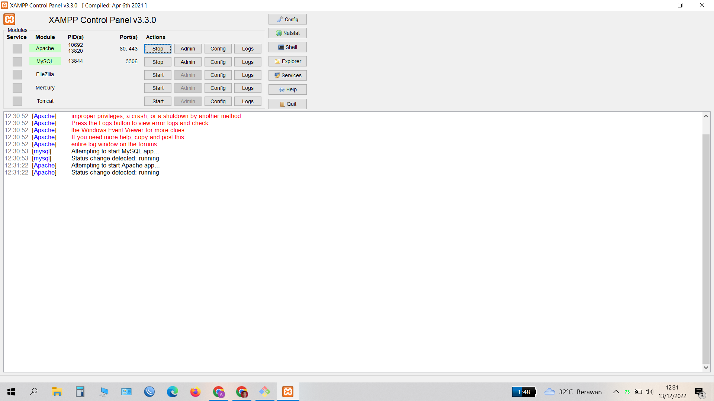
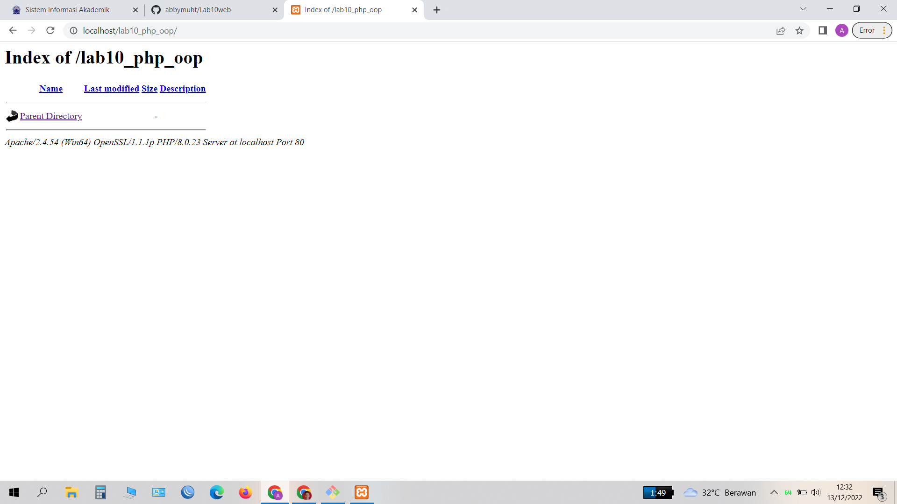
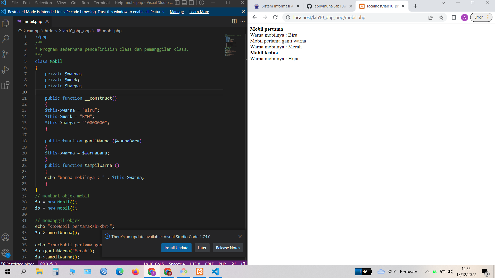
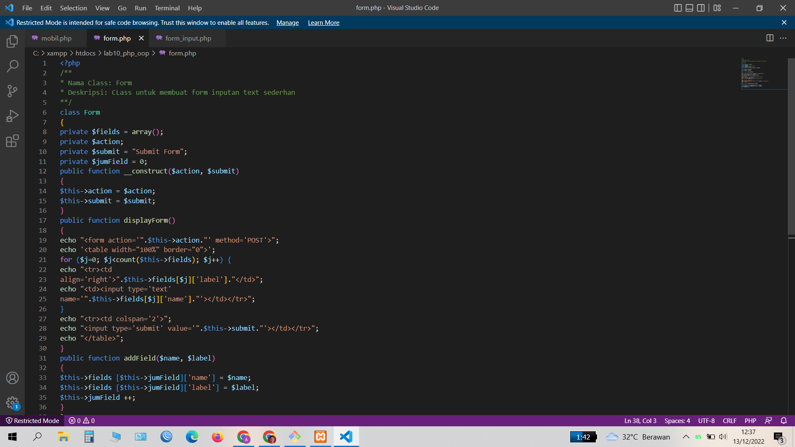
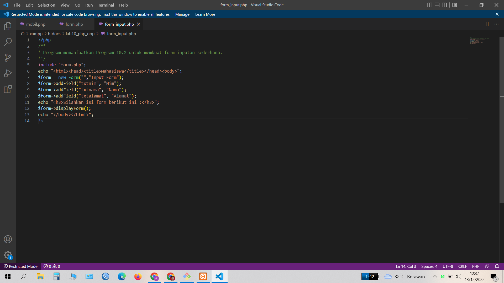
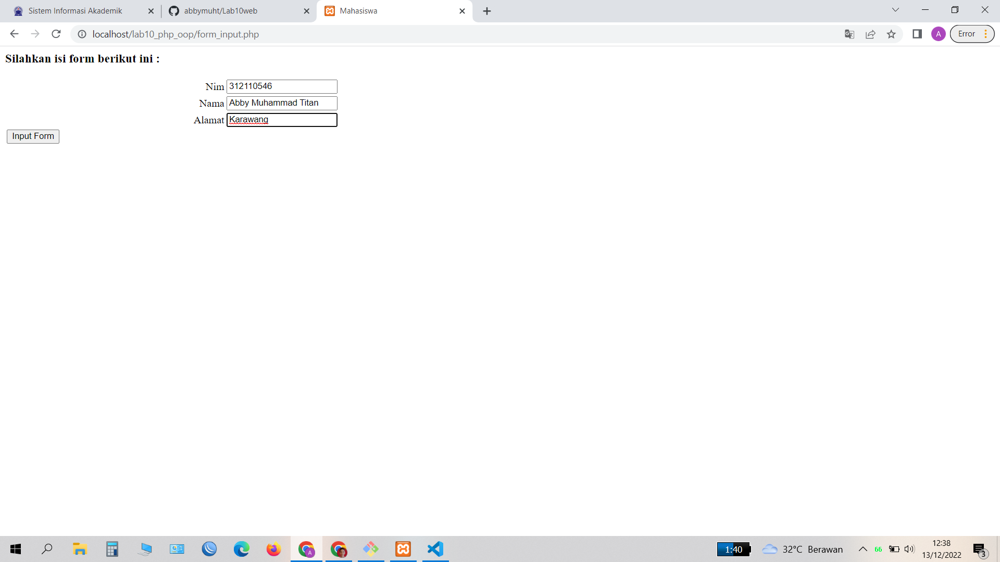

# Lab10web
# Nama      : Abby Muhammad Titan
# Nim       : 312110546
# Kelas     : TI.21.B1
# UNIVERSITAS PELITA BANGSA
# Langkah 1
# Membuka xampp, kemudian start apache dan mysql

# Langkah 2
# Membuat folder baru dengan nama lab10_php_oop pada folder htdocs di xampp

# Langkah 3
# Buat file baru dengan nama mobil.php dan hasil nya seperti berikut :

# Langkah 4
# Buat file baru dengan nama form.php 

# Langkah 5
# Buat file baru dengan nama form_input

# Langkah 6
# Simpan pada folder lab10_php_oop yang telah dibuat kemudian buka pada browser dengan link http://localhost/lab10_php_oop/form_input.php

#
# Cukup sekian penjelasan dari saya
# TERIMA KASIH